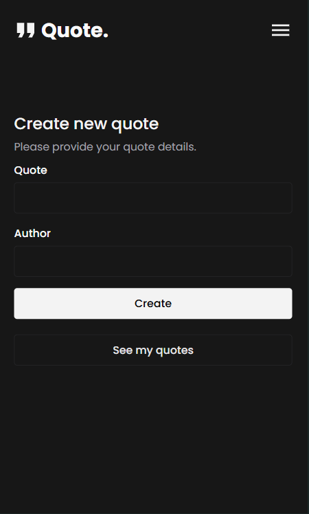
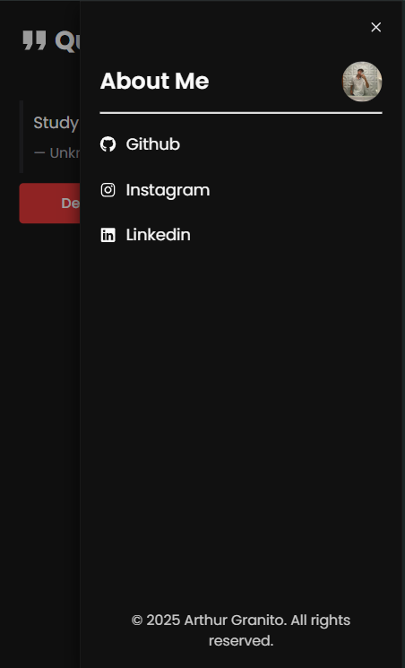

# Quote Generator

A mobile-focused application built with **React**, **Vite**, and **Chakra UI**. The app allows users to input a quote and an author, generate a styled quote, and download it as a PNG file. Users can also view, manage, and delete their saved quotes.

## Features
- **Input and Generate Quotes**: Enter a quote and its author, then click to generate a beautifully styled quote.
- **Download as PNG**: Save the generated quote in PNG format.
- **View All Saved Quotes**: Access a list of all saved quotes and manage them.
- **Manage Quotes**: Delete any saved quotes you no longer need.

## Screenshots

### 1. **Home Screen - Add New Quote**


### 2. **Generated Quote Screen**


### 3. **Saved Quotes List**


### 4. **Sidebar**


## Tech Stack
- **React**: For building the user interface.
- **Vite**: For fast and optimized builds.
- **Chakra UI**: For responsive, accessible UI components.

## Installation

To run this project locally, follow these steps:

1. Clone the repository:

```bash
git clone <repository-url>

2. Install Dependencies:

```bash
cd <project-folder>
npm install

3. Run the project:

```bash
npm run dev
